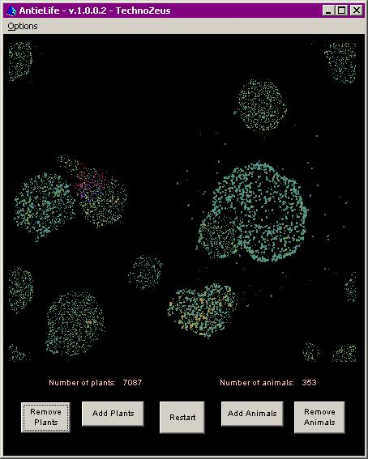



## AntieLife \- improved revision 2

### Description

Great news! Eric O'Sullivan was nice enough to go through the AntieLife revision 2 that I had uploaded, and make a bunch of changes to speed it up. He's given me permission to upload he improved revision 2 here, so I'm submitting it as a replacement for me earlier revision.

Based on and partially derived from Imitate Life v2.0, by Eric O'Sullivan on Planet-Source-Code. This simulation of life uses primative virtual life forms to demonstrate adaptation by natural selection. The name of the program is a bit of a play on words, since the program it was based on used ants and ant-eaters.

Thanks, Eric.

Don.
 
### More Info
 

             |
---                |---
**Submitted On**   |2006-02-24 10:00:38
**By**             |[Donald A\. Kronos, Ph\.D\.](https://github.com/Planet-Source-Code/PSCIndex/blob/master/ByAuthor/donald-a-kronos-ph-d.md)
**Level**          |Intermediate
**User Rating**    |4.0 (8 globes from 2 users)
**Compatibility**  |VB 6\.0
**Category**       |[Complete Applications](https://github.com/Planet-Source-Code/PSCIndex/blob/master/ByCategory/complete-applications__1-27.md)
**World**          |[Visual Basic](https://github.com/Planet-Source-Code/PSCIndex/blob/master/ByWorld/visual-basic.md)
**Archive File**   |[AntieLife\_1976322262006\.zip](https://github.com/Planet-Source-Code/donald-a-kronos-ph-d-antielife-improved-revision-2__1-64339/archive/master.zip)

